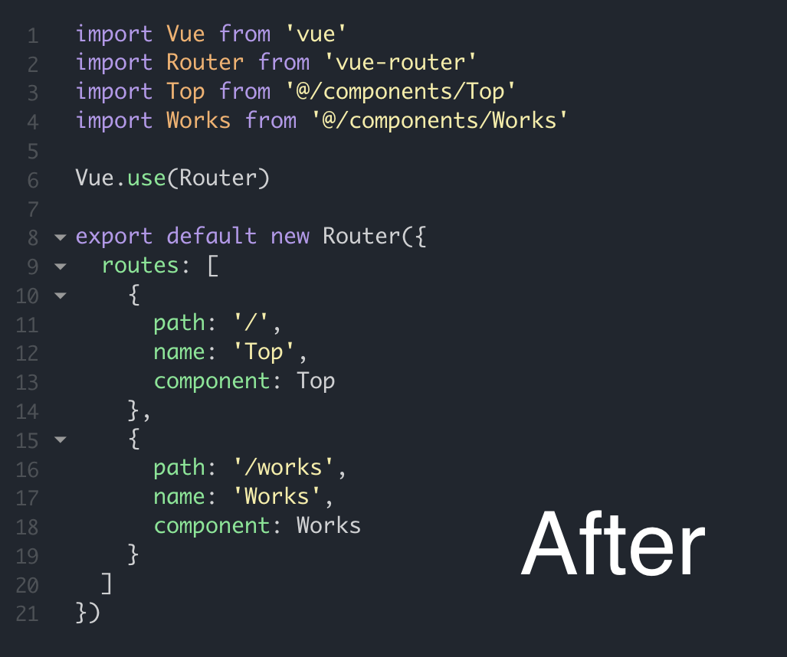

# vue-portfolio-template
## 準備
- `vue init webpack <appname>` でアプリケーションの初期化
  - ex) `vue init webpack my-vue-portfolio`
  - 設定

|question|answer|note|
|---|---|---|
|`? Project name`|自由に決めてください！||
|`? Project description`|`<Enter>`|デフォルト|
|`? Author`|`<Enter>`|ローカルのgitconfigに設定されてるものがデフォルトで出るはず|
|`? Vue build`|`<Enter>`|一番上の選択肢|
|`? Install vue-router`|`Y`|Enter押せば`Y`になるよ|
|`? Use ESLint to lint your code?`|`Y`|Enter押せば`Y`になるよ|
|`? Pick an ESLint preset`|`<Enter>`|一番上の選択肢|
|`? Set up unit tests`|`n`|`n`をタイプして`<Enter>`!|
|`? Setup e2e tests with Nightwatch?`|`n`|`n`をタイプして`<Enter>`!|
|`? Should we run 'npm install' for you after...`|`npm` or `yarn`|矢印キーでどっちか選んでください。僕は`yarn`の方が好きです|

- sass用のモジュールをインストール(`npm`と`yarn`どっちか)
  - `npm install --save node-sass sass-loader`
  - `yarn add node-sass sass-loader`
- 以下のレポジトリから二つのフォルダをダウンロード
  - https://github.com/kthatoto/vue-portfolio-template-assets
  - `assets`を自分で作成したアプリケーションの`./src/assets`と交換
  - `components`を自分で作成したアプリケーションの`./src/components`と交換

## ハンズオン
### ./src/App.vue
- 共通スタイルの編集
- rootテンプレートの編集
  - `./src/components/Menu.vue`をインポート

### ./src/router/index.js
- `/`に`Top`コンポーネント、`/works`に`Works`コンポーネントを割り当てる

